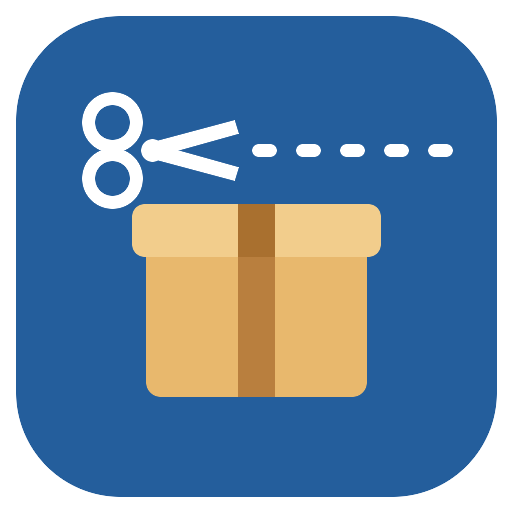

<p align="center">
  
</p>

<h1 align="center">secureclient-repack</h1>

<p align="center"><strong>Trim the Cisco Secure Client installer down to the modules you actually deploy.</strong></p>

<p align="center">
  
  
  
  
  <a href="https://ko-fi.com/jwalkes"></a>
</p>

Cisco ships Secure Client as an everything-included installer: VPN, Umbrella, DART, posture agents, ThousandEyes and more. Most organisations deploy two or three of those modules, yet the stock package advertises them all to your MDM, bloats the upload and clutters the app inventory. secureclient-repack takes your own licensed predeploy package and produces a lean, deployment-ready build containing only the modules you choose — repackaged and re-signed on macOS, selected and scripted on Windows.

An interactive run looks like this:

```
$ ./secureclient-repack.sh
== Locating Secure Client DMG in /Users/you/Downloads ==
Using: /Users/you/Downloads/cisco-secure-client-macos-5.1.10.233-predeploy-k9.dmg
== Mounting DMG ==
Copied: Cisco Secure Client.pkg
== Expanding ==

Modules in this package — choose which to KEEP (pinned = required base):

   1) [x] VPN — Core & AnyConnect (base client, pinned)
   2) [x] GUI / UI shell (pinned)
   3) [ ] Umbrella Roaming Security
   4) [ ] DART — Diagnostics & Reporting
   5) [ ] ISE Posture
   6) [ ] Network Visibility Module

  toggle: numbers (e.g. 2 6)    a: keep all    n: pinned only    Enter: accept
> 3

Keeping:-vpn-ui-umbrella
...
== Signature ==
Package "Cisco Secure Client-5.1.10.233-vpn-ui-umbrella-signed.pkg":
   Status: signed by a developer certificate issued by Apple
```

## What it does

- **Module selection** — interactive checklist or a `--keep vpn,umbrella,dart` flag; the core VPN and UI shell are pinned because the client cannot run without them.
- **Full strip (macOS)** — removes each dropped module's install choice, its pkg-refs *and* its payload folder, so the rebuilt pkg only advertises what it contains. Shared payloads that a kept module still needs are protected automatically.
- **Re-signing (macOS)** — signs the rebuilt pkg with your "Developer ID Installer" identity, or stops at an unsigned pkg with `--no-sign`.
- **Deployment scripts (Windows)** — copies the kept MSIs out of the predeploy zip and generates `install.ps1`, `uninstall.ps1` and `detect.ps1`, ready for an Intune Win32 app or any MDM that runs PowerShell. Install returns the real msiexec result, including `3010` when a reboot is needed; detection is version-aware, so upgrades actually deploy.
- **Signature checking (Windows)** — every kept MSI's Authenticode signature is verified and its signer reported. Anything not validly signed is refused unless you pass `-AllowUnsignedMsi`.
- **Umbrella OrgInfo handling** — validates your `OrgInfo.json` and emits it as a root shell script (macOS) or embeds it in `install.ps1` (Windows) so the module registers with your dashboard.
- **Safety guards** — the transform is verified before anything is built: every kept choice must survive, every dropped choice must be gone and every referenced payload must still exist, otherwise the run aborts.
- **Scriptable throughout** — every prompt has a corresponding flag, so both tools run unattended in a pipeline.

## Security posture

- Runs entirely on your machine; nothing is uploaded anywhere.
- Does not download or redistribute any Cisco software — you supply your own licensed predeploy package from your Cisco account.
- macOS signing uses a "Developer ID Installer" identity already present in your Keychain; the tool never exports, stores or transmits keys.
- The Windows MSIs are copied unmodified, and their Authenticode signatures are verified before packaging.
- Your `OrgInfo.json` is only ever written into the generated deployment artefacts you asked for.

The generated artefacts run as root or SYSTEM on every endpoint you deploy them to, so the tools treat the package they are handed as untrusted input:

- Payload paths read out of a package's `Distribution` are validated before any deletion, so a crafted package cannot reach outside the temporary work directory.
- The Umbrella profile is embedded base64-encoded rather than inline, so no profile content can be interpreted as shell, and the profile is confirmed to be JSON rather than merely a valid property list.
- MSI filenames are constrained and emitted as quoted literals, so a bundle cannot smuggle PowerShell into the generated installer.
- Archive entries that would extract outside the work directory are refused.

## Where things live

| Item | Location |
|---|---|
| Work area (macOS) | a `mktemp -d` directory, removed on success, kept for inspection on failure |
| Work area (Windows) | a random folder under `%TEMP%`, always removed |
| Output pkg and `deploy-orginfo.sh` (macOS) | next to the source DMG, or `--output <dir>` |
| Deployment folder (Windows) | next to the source zip, or `-Output <dir>` |
| Settings, logs, telemetry | none — nothing is persisted anywhere else |

## Install and run

Clone the repo or grab the scripts from the [latest release](https://github.com/jermainewalkes/secureclient-repack/releases).

### macOS

Everything needed ships with macOS (bash 3.2, `pkgutil`, `xsltproc`, `productsign`).

```sh
git clone https://github.com/jermainewalkes/secureclient-repack.git
cd secureclient-repack
./secureclient-repack.sh
```

### Windows

Windows PowerShell 5.1 or newer.

```powershell
git clone https://github.com/jermainewalkes/secureclient-repack.git
cd secureclient-repack
powershell -ExecutionPolicy Bypass -File .\secureclient-repack.ps1
```

## Usage examples

```sh
# fully interactive: find the DMG in ~/Downloads, pick modules, sign
./secureclient-repack.sh

# unattended: keep Umbrella (plus the pinned base), skip the confirmation
./secureclient-repack.sh --keep umbrella --yes

# explicit inputs, unsigned output to a build directory
./secureclient-repack.sh --dmg ~/pkgs/csc.dmg --keep all --no-sign --output /tmp/out

# pick a specific certificate and OrgInfo file
./secureclient-repack.sh --keep umbrella,dart --identity "Developer ID Installer: Example Corp" \
  --orginfo ~/Downloads/OrgInfo.json --yes
```

```powershell
# fully interactive
.\secureclient-repack.ps1

# unattended: keep Umbrella and DART, wrap into an .intunewin if the tool is on PATH
.\secureclient-repack.ps1 -Keep umbrella,dart -Yes -IntuneWin

# explicit inputs, replacing a previous build of the same version
.\secureclient-repack.ps1 -Zip C:\pkgs\csc-predeploy.zip -Keep all -Output C:\out -Yes -Force
```

Module codes: `vpn` `ui` `umbrella` `dart` `ise` `nvm` `te` `zta` `sfp` `amp` (macOS), plus `nam` and `sbl` on Windows. Only codes present in your package apply. Secure Firewall Posture is `sfp`; ISE Posture is `ise`.

## MDM deployment

### Intune (macOS)

- Upload the signed pkg as a **macOS app (PKG)**. "Included apps" now lists only the kept modules; keep the GUI (`com.cisco.secureclient.gui`) as the first entry.
- Upload `deploy-orginfo.sh` under **Devices > macOS > Shell scripts** (runs as root, no detection needed). Deploy it before or alongside the client.
- Umbrella also needs the system-extension approval and Umbrella root certificate configuration profiles, plus the VPN profile XML, as usual.

### Intune (Windows)

- Upload the deployment folder as a **Win32 app** (wrap it with `-IntuneWin` or the Win32 Content Prep Tool). Use the generated `install.ps1`, `uninstall.ps1` and `detect.ps1`.
- Map exit code **3010** to "soft reboot" in the app's return codes. `install.ps1` returns it when a module asks for a restart, so the client finishes cleanly instead of being reported as failed.
- `detect.ps1` compares the installed core version against the version in the package, so upgrades and added modules are delivered rather than skipped. It identifies modules by their Add/Remove Programs `DisplayName`; those strings are listed at the top of the script — confirm them against a pilot device once, and edit them there if your Cisco build labels a module differently.
- Set **Run script as 32-bit process on 64-bit clients** to **No** for the detection script, so it reads the native registry view.

### Jamf Pro and Kandji (macOS)

- Deploy the signed pkg as a standard package.
- Run `deploy-orginfo.sh` as a script policy (root), matching Cisco's own Jamf guidance for Umbrella registration.

### Why OrgInfo ships as a script, not a pkg

A config-only pkg contains no app bundle, and MDMs that detect PKG installs by bundle ID (Intune's PKG app type, for example) would never report it as installed — a phantom-detection failure that leaves the deployment permanently "pending". A root script needs no detection, works on every MDM that can run scripts and is the mechanism Cisco's own deployment guidance uses.

### The Umbrella re-registration caveat

Secure Client consumes `OrgInfo.json` on first launch and copies it into its `data` directory. On a device that has already registered, a replacement `OrgInfo.json` is ignored until that `data` directory is cleared or the Umbrella module is reinstalled. The generated scripts carry this note too.

## Troubleshooting

- **"No 'Developer ID Installer' identity found"** — the unsigned pkg is still produced; sign it on the machine that holds the certificate, or install the certificate into your login Keychain and re-run.
- **Multiple DMGs or OrgInfo files found** — in interactive mode you get a menu; in scripted mode pass `--dmg` / `--orginfo` (`-Zip` / `-OrgInfo` on Windows) explicitly.
- **Replacement OrgInfo.json seems ignored** — see the re-registration caveat above.
- **"Could not identify the core VPN MSI"** — the zip you selected is probably a webdeploy bundle; download the *predeploy* package instead.
- **"These MSIs are not validly signed"** — the bundle is incomplete, tampered with, or came from a mirror rather than Cisco. Re-download it. Pass `-AllowUnsignedMsi` only if you knowingly re-signed the MSIs yourself.
- **"Output folder already exists"** — a build of that version and module set is already there; pass `-Force` to replace it.
- **"The bundle contains repeated MSI filenames"** — the zip has the same MSI in more than one subfolder, so the tool cannot tell which copy to ship. Extract the architecture you want and point `-Zip` at a bundle containing just that.
- **"Refusing an unsafe payload path"** or **"Refusing archive entry that escapes"** — the package is malformed or has been tampered with. Do not deploy it; re-download from Cisco.
- **Windows app installs but Intune reports a failure** — check the return codes mapping; `3010` means the install succeeded and a reboot is pending.
- **Gatekeeper blocks the script on first run** — if you downloaded the scripts rather than cloning, clear the quarantine flag with `xattr -d com.apple.quarantine secureclient-repack.sh`.

## Development

```
secureclient-repack/
├── secureclient-repack.sh        # macOS tool (bash 3.2, stock tools only)
├── secureclient-repack.ps1       # Windows tool (PowerShell 5.1 compatible)
├── assets/                       # icon.svg + make-icon.sh regenerate icon.png
├── tests/
│   ├── fixtures/Distribution.xml # synthetic multi-module Distribution
│   ├── e2e/                      # synthetic DMG and zip builders + assertions
│   ├── macos.bats                # bats-core suite (37 tests)
│   └── windows.Tests.ps1         # Pester suite (37 tests)
└── .github/workflows/ci.yml      # shellcheck + bats, PSScriptAnalyzer + Pester
```

CI does not stop at unit tests: both jobs build a synthetic package from `tests/e2e`, run the real tool over it end to end and assert the resulting artefacts — the stripped `Distribution`, the deleted payloads and the generated scripts.

Run the tests:

```sh
brew install shellcheck bats-core
shellcheck secureclient-repack.sh
bats tests/macos.bats
```

```powershell
Invoke-ScriptAnalyzer -Path .\secureclient-repack.ps1
Invoke-Pester tests\windows.Tests.ps1
```

Both scripts expose their internals for testing when sourced with `SECURECLIENT_REPACK_TEST` set, so the suites run against synthetic fixtures without any Cisco content.

## Accessibility

Both tools are plain-text command-line programs: prompts are linear and screen-reader friendly, selection state is shown with `[x]` markers rather than colour and no information is conveyed by colour alone.

## Support

secureclient-repack is free software under the [MIT licence](LICENSE). If it saved you an afternoon of installer surgery, you can support development on [Ko-fi](https://ko-fi.com/jwalkes).

---

This project is not affiliated with, endorsed by or supported by Cisco Systems, Inc. Cisco, Cisco Secure Client, AnyConnect and Umbrella are trademarks of Cisco Systems, Inc. You must obtain Secure Client from your own Cisco account under your own licence.
